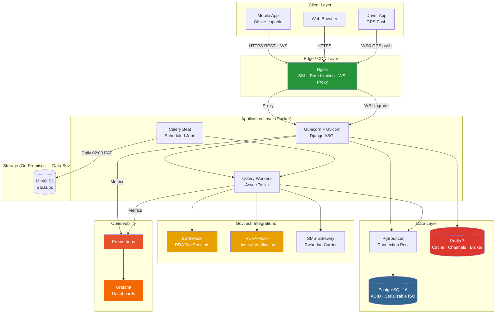
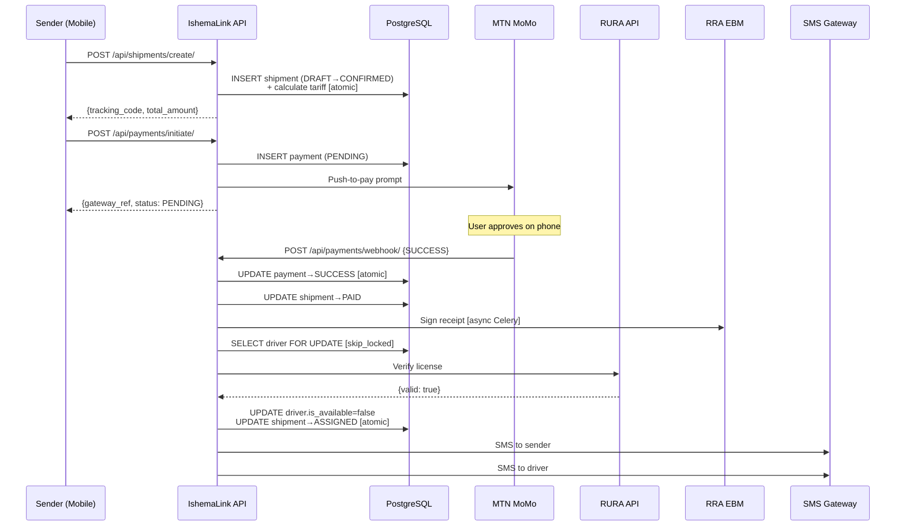
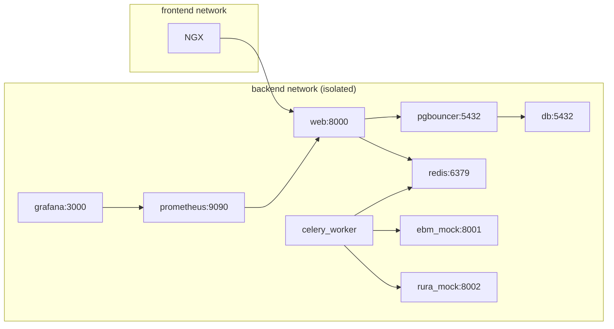

```mermaid
graph TB
    subgraph Clients["Client Layer"]
        MOB[Mobile App<br/>Offline-capable]
        WEB[Web Browser]
        DRV[Driver App<br/>GPS Push]
    end

    subgraph Edge["Edge / CDN Layer"]
        NGX[Nginx<br/>SSL · Rate Limiting · WS Proxy]
    end

    subgraph App["Application Layer (Docker)"]
        WS[Gunicorn + Uvicorn<br/>Django ASGI]
        CEL[Celery Workers<br/>Async Tasks]
        BEAT[Celery Beat<br/>Scheduled Jobs]
    end

    subgraph Data["Data Layer"]
        PGB[PgBouncer<br/>Connection Pool]
        PG[(PostgreSQL 16<br/>ACID · Serializable ISO)]
        RD[(Redis 7<br/>Cache · Channels · Broker)]
    end

    subgraph GovTech["GovTech Integrations"]
        EBM[EBM Mock<br/>RRA Tax Receipts]
        RURA[RURA Mock<br/>License Verification]
        SMS[SMS Gateway<br/>Rwandan Carrier]
    end

    subgraph Observe["Observability"]
        PROM[Prometheus]
        GRAF[Grafana<br/>Dashboards]
    end

    subgraph Storage["Storage (On-Premises — Data Sovereignty)"]
        MINIO[(MinIO S3<br/>Backups)]
    end

    MOB -->|HTTPS REST + WS| NGX
    WEB -->|HTTPS| NGX
    DRV -->|WSS GPS push| NGX

    NGX -->|Proxy| WS
    NGX -->|WS Upgrade| WS

    WS --> PGB
    WS --> RD
    WS --> CEL
    CEL --> PGB
    CEL --> EBM
    CEL --> RURA
    CEL --> SMS
    BEAT --> CEL

    PGB --> PG

    WS -->|Metrics| PROM
    CEL -->|Metrics| PROM
    PROM --> GRAF

    BEAT -->|Daily 02:00 EAT| MINIO

    style PG fill:#336791,color:#fff
    style RD fill:#DC382D,color:#fff
    style NGX fill:#269539,color:#fff
    style EBM fill:#E8A000,color:#fff
    style RURA fill:#E8A000,color:#fff
    style PROM fill:#E6522C,color:#fff
    style GRAF fill:#F46800,color:#fff
```

## Booking Flow Sequence

```mermaid
sequenceDiagram
    participant S as Sender (Mobile)
    participant API as IshemaLink API
    participant DB as PostgreSQL
    participant MoMo as MTN MoMo
    participant RURA as RURA API
    participant EBM as RRA EBM
    participant SMS as SMS Gateway

    S->>API: POST /api/shipments/create/
    API->>DB: INSERT shipment (DRAFT→CONFIRMED)<br/>+ calculate tariff [atomic]
    API-->>S: {tracking_code, total_amount}

    S->>API: POST /api/payments/initiate/
    API->>DB: INSERT payment (PENDING)
    API->>MoMo: Push-to-pay prompt
    API-->>S: {gateway_ref, status: PENDING}

    Note over MoMo: User approves on phone

    MoMo->>API: POST /api/payments/webhook/ {SUCCESS}
    API->>DB: UPDATE payment→SUCCESS [atomic]
    API->>DB: UPDATE shipment→PAID
    API->>EBM: Sign receipt [async Celery]
    API->>DB: SELECT driver FOR UPDATE [skip_locked]
    API->>RURA: Verify license
    RURA-->>API: {valid: true}
    API->>DB: UPDATE driver.is_available=false<br/>UPDATE shipment→ASSIGNED [atomic]
    API->>SMS: SMS to sender
    API->>SMS: SMS to driver
```

## Container Network Diagram

```mermaid
graph LR
    subgraph frontend["frontend network"]
        NGX
    end
    subgraph backend["backend network (isolated)"]
        WS[web:8000]
        CEL[celery_worker]
        PGB[pgbouncer:5432]
        PG[db:5432]
        RD[redis:6379]
        EBM[ebm_mock:8001]
        RURA[rura_mock:8002]
        PROM[prometheus:9090]
        GRAF[grafana:3000]
    end

    NGX --> WS
    WS --> PGB --> PG
    WS --> RD
    CEL --> RD
    CEL --> EBM
    CEL --> RURA
    PROM --> WS
    GRAF --> PROM
```
